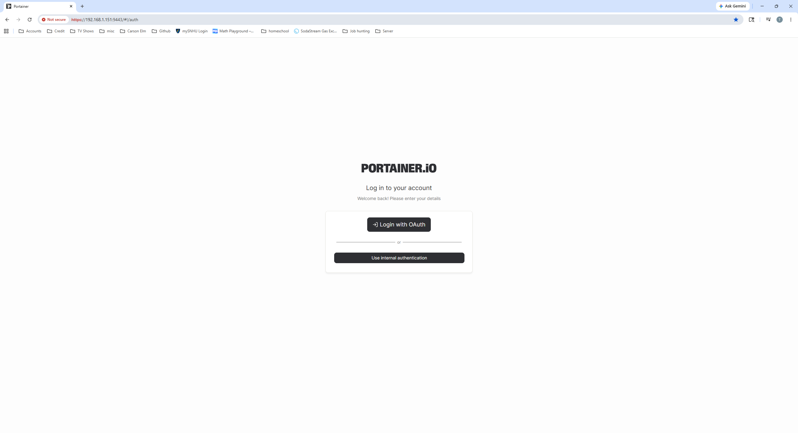
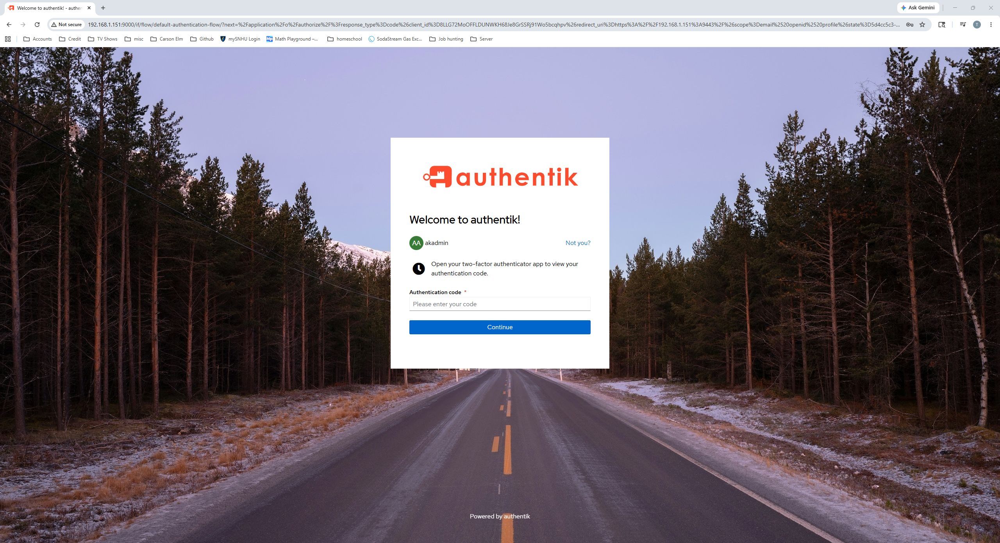
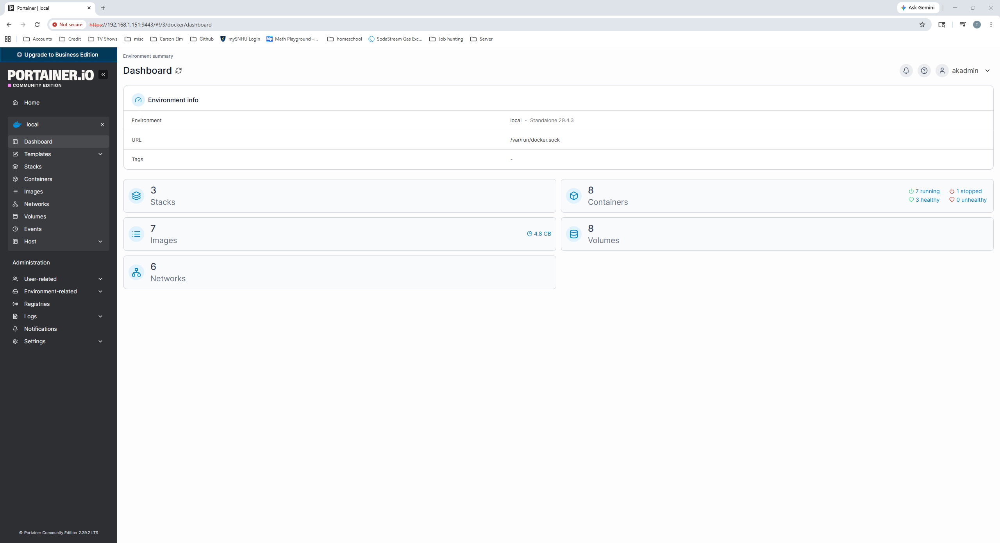

# Home Cybersecurity Lab

Hands-on cybersecurity home lab focused on Linux administration, IAM, MFA, monitoring, Docker, and operational security.

---

# Documentation Structure

## Architecture

- [Lab Architecture](architecture/lab-architecture.md)

---

## Services

- [Portainer](services/portainer.md)
- [Uptime Kuma](services/uptime-kuma.md)
- [Authentik](services/authentik.md)
- [Nginx Proxy Manager](services/nginx-proxy-manager.md)

---

## Security Controls

- [MFA and IAM](security-controls/mfa-and-iam.md)
- [Monitoring](security-controls/monitoring.md)
- [Patch Management](security-controls/patch-management.md)
- [Remote Administration](security-controls/remote-administration.md)

---

## Lessons Learned

- [Lessons Learned](lessons-learned.md)

---

# Current Technologies

- Ubuntu Server
- Docker
- Portainer
- Uptime Kuma
- Authentik
- Nginx Proxy Manager
- SSH
- UFW Firewall

---

# Security Concepts Practiced

- MFA
- IAM
- OAuth/OIDC
- Authentication vs authorization
- Reverse proxy architecture
- Monitoring and visibility
- Patch management
- Containerized infrastructure
- Operational troubleshooting
- Administrative access control

---

# Screenshots

## Portainer OAuth Login

---

## Authentik MFA Prompt

---

## Portainer Dashboard

